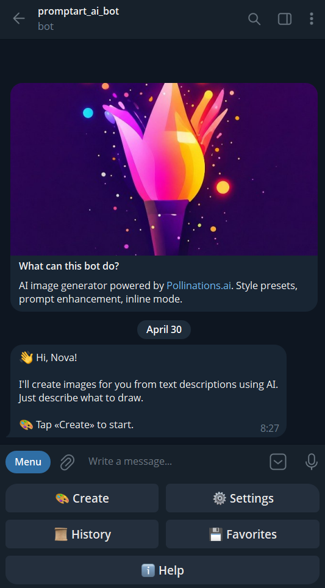
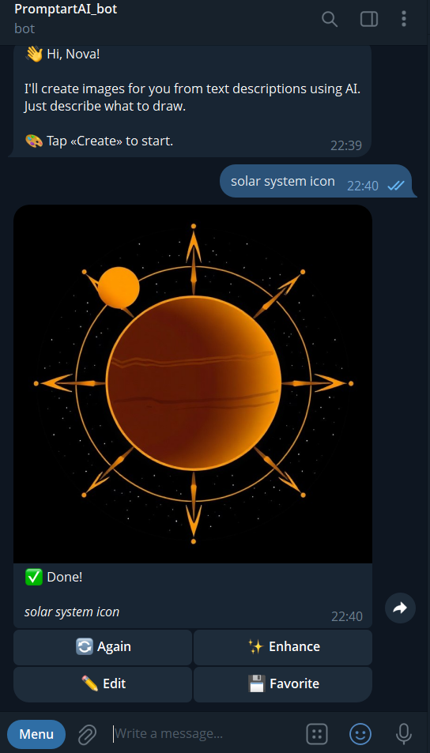
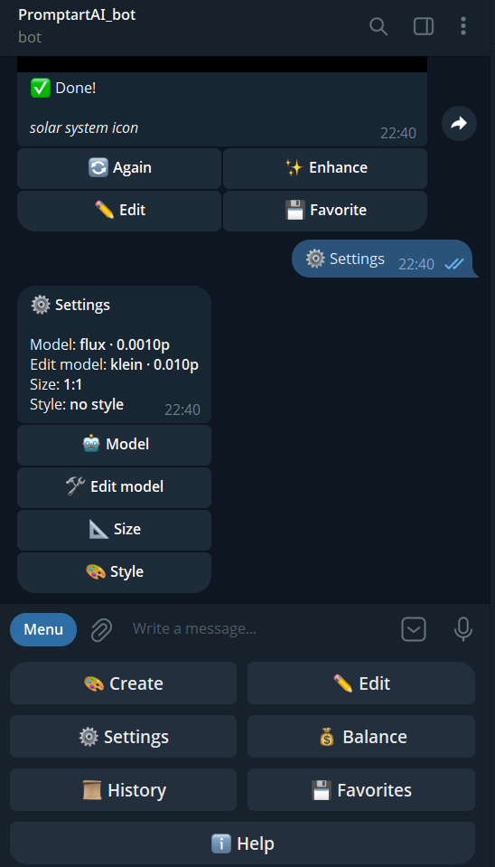
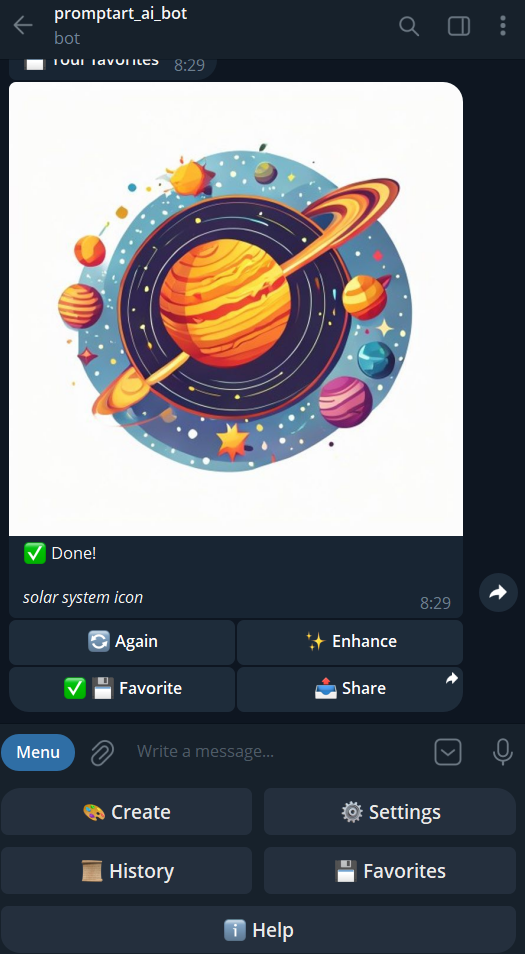
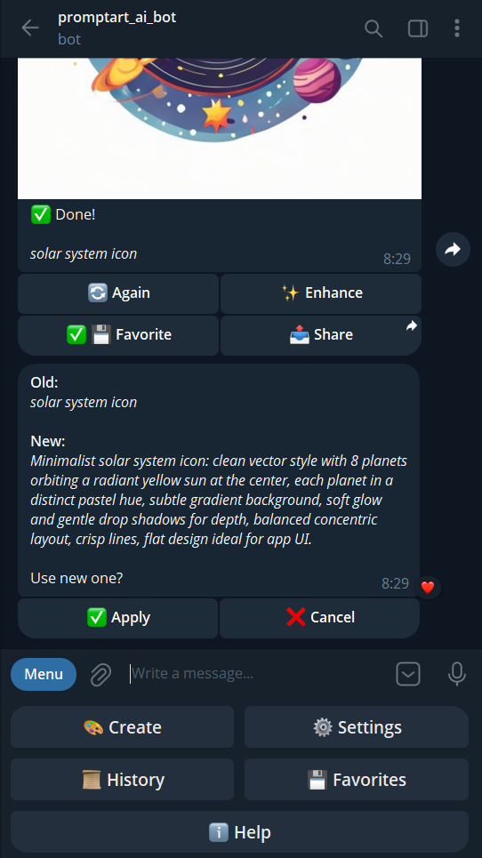

# PromptArt — AI Image Generation Telegram Bot

[](https://www.python.org/)
[](LICENSE)
[](https://pollinations.ai)

> Telegram bot for AI image generation via [Pollinations.ai](https://pollinations.ai). Style presets, prompt enhancement, inline mode, history & favorites.

<p align="center">
  
</p>

## Screenshots

<p align="center">
  
  
  
</p>
<p align="center">
  
  
</p>

## Features

- **Image generation** — 4 models (Flux, Turbo/Zimage, Seedream, GPT-Image-2) via Pollinations `/v1/images/generations`
- **5 aspect ratios** — 1:1, 16:9, 9:16, 4:3, 3:4
- **7 style presets** — photorealistic, anime, digital painting, oil, 3D, cyberpunk, sketch
- **Prompt enhancement** — one-tap improvement via Pollinations `/v1/chat/completions` (OpenAI-compatible)
- **History & favorites** — last 10 generations, save to favorites for quick re-send
- **Rate limiting** — built-in protection (5 generations / minute)
- **Graceful tier handling** — premium models show a clear message instead of crashing when pollen balance is too low

## Quick start

```bash
# 1. Clone and install
git clone https://github.com/zFannur/promptart-bot.git
cd promptart-bot
python -m venv .venv
source .venv/bin/activate    # Windows: .venv\Scripts\activate
pip install -r requirements.txt

# 2. Configure
cp .env.example .env
# edit .env with your tokens

# 3. Run
python bot.py
```

## Getting tokens

**Telegram bot token:**
1. Open [@BotFather](https://t.me/BotFather) in Telegram
2. Send `/newbot`, follow the prompts
3. Copy the token like `123456789:ABCDef...` into `BOT_TOKEN`
4. Send `/setinline` and pick a placeholder text (e.g. "Describe an image…")

**Pollinations API key:**
1. Go to [pollinations.ai](https://pollinations.ai) and sign in via GitHub
2. Generate an API key in your dashboard
3. Copy the `sk_...` key into `POLLINATIONS_API_KEY`

**Your Telegram ID** (for `ADMIN_ID`):
- Open [@userinfobot](https://t.me/userinfobot) and send any message

## Project structure

```
promptart_bot/
├── bot.py                  # entry point
├── config.py               # pydantic-settings
├── handlers/               # telegram handlers
├── services/               # pollinations client, db
├── keyboards/              # inline + reply keyboards
├── middlewares/            # i18n, rate limit
├── states/                 # FSM
├── utils/                  # constants, helpers
├── locales/                # en.json
├── data/                   # sqlite db (gitignored)
└── assets/                 # screenshots, logo
```

## Deploy to Railway

> ⚠️ **DATA LOSS WARNING.** Railway containers have **ephemeral** filesystems
> — every `git push` (redeploy) wipes the working tree, including the SQLite
> database. If you skip step 5 below, **all users lose their history,
> favorites, and settings on every deploy**. The bot will print a loud
> warning at startup if it detects this misconfiguration.

1. Push the repo to GitHub.
2. Sign in at [railway.app](https://railway.app) with GitHub.
3. **New Project → Deploy from GitHub repo** → pick this repo.
4. In **Variables**, add:
   - `BOT_TOKEN`
   - `POLLINATIONS_API_KEY`
   - `ADMIN_ID`
   - `DB_PATH=/data/bot.db`  ← **must** match the volume mount path in step 5
5. **REQUIRED**: In **Settings → Volumes**, **create a new Volume**:
   - **Mount path**: `/data`
   - Size: 1 GB is enough for thousands of users
   - This is what makes the DB survive redeploys. Without it, every push to
     GitHub destroys all user data.
6. Hit **Deploy**. Railway uses `Procfile` automatically.

**Verify persistence after first deploy:** run `/start` in Telegram, then
push any change to GitHub. After Railway redeploys, your `/history` and
`/favorites` should still show the same entries. If they're empty, the
volume isn't mounted — go back to step 5.

## Tech stack

- **aiogram 3.13** — async Telegram framework
- **httpx** — async HTTP client with timeout/retry
- **aiosqlite** — async SQLite
- **pydantic-settings** — env config
- **loguru** — logging
- **Pillow** — image post-processing

## Pollinations Hive

This bot is built for the [Pollinations Hive](https://github.com/pollinations/hive) registry. All API calls include `referrer=promptart-bot` for proper attribution.

## License

MIT — see [LICENSE](LICENSE).

Built with [Pollinations.ai](https://pollinations.ai).
