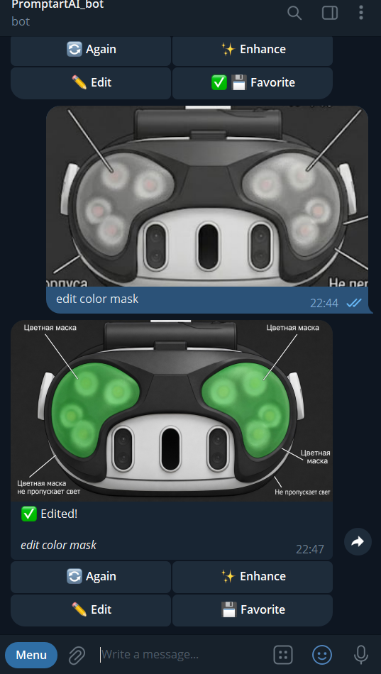
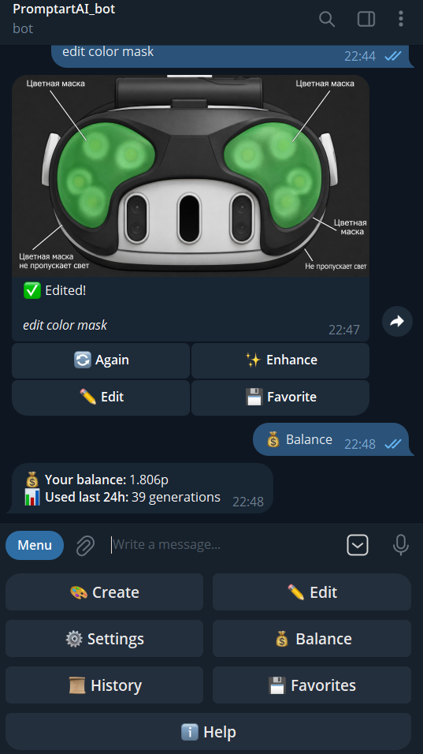
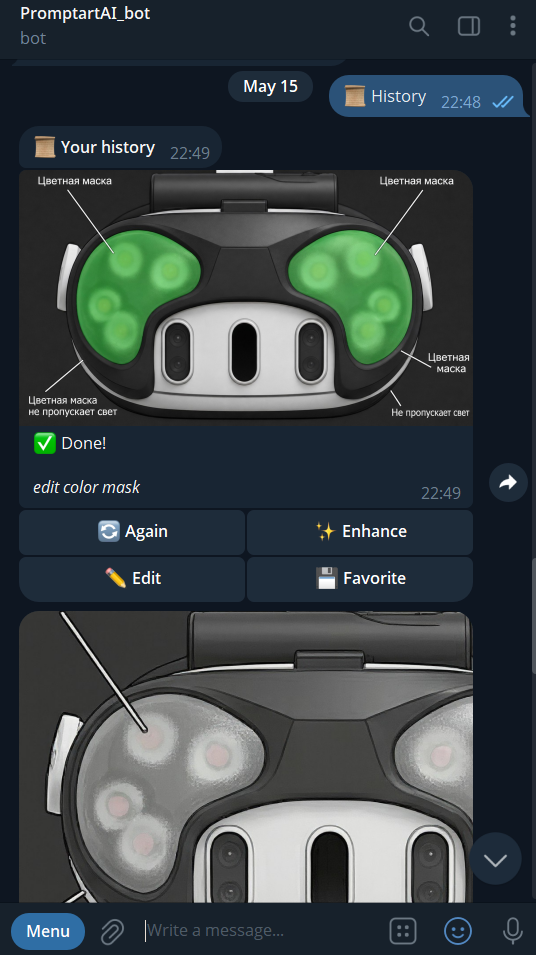

# PromptArt — AI Image Generation & Editing Telegram Bot

[](https://www.python.org/)
[](LICENSE)
[](https://pollinations.ai)

> Telegram bot for AI image **generation** and **in-context editing** via
> [Pollinations.ai](https://pollinations.ai). Multi-photo edits, live model
> catalog with pricing, history previews, automatic photo detection.

<p align="center">
  
</p>

## Screenshots

<p align="center">
  
  
  
</p>
<p align="center">
  
  
  
</p>
<p align="center">
  
</p>

## Features

### Generation
- **19+ live models** fetched from `gen.pollinations.ai/models` (no hard-coded list) — flux, zimage, kontext, qwen-image, wan-image, gptimage, etc.
- **Live pricing per model** in `/settings → 🤖 Model` — sorted by pollen cost, ✅/❌ marker against current balance
- **5 aspect ratios** at SDXL-canonical resolutions (1024², 1344×768, 768×1344, 1152×896, 896×1152) — multiples of 64, ~1 MP each, so output never gets stretched
- **7 style presets** — photorealistic, anime, digital painting, oil, 3D, cyberpunk, sketch
- **Prompt enhancement** via `/v1/chat/completions` (OpenAI-compatible)

### Editing (in-context, 1–4 input photos)
- Tap **«✏️ Edit»** or send a photo directly to the bot — auto-detected
- Drop **multiple photos + a description** like "combine these", "replace background with neon city", "put the hat from photo 2 on the person in photo 1"
- Separate **edit model** setting (default `klein` @ 0.01p, picker filtered to image-input-capable models)
- **«✏️ Edit»** button under every generated/edited photo and every history entry — one-tap re-edit
- **«🔄 Again»** and **«✨ Enhance»** on edited photos re-edit with the original input photos (no source loss)

### History & balance
- **/history** and **/favorites** send actual photo previews with the full Again/Edit/Favorite keyboard
- **/balance** shows current pollen + count of generations in the last 24 h (from `/account/usage`)
- Saves prompt, model, ratio, style, seed, source photos, and Telegram `file_id` per generation

### Reliability
- **Rate limit** — 5 generations / minute per user
- **Retries** — exponential backoff for network errors and 5xx
- **Typed errors** — `NSFWRejected`, `PremiumRequired`, `QuotaExhausted`, `PollinationsError` surface as user-friendly messages
- **Idempotent DB migrations** — every new column is added with `ALTER TABLE … IF NOT EXISTS`-style logic so the Railway volume survives every redeploy without manual SQL

## Quick start

```bash
# 1. Clone and install
git clone https://github.com/zFannur/promptart-bot.git
cd promptart-bot
python -m venv .venv
source .venv/bin/activate    # Windows: .venv\Scripts\activate
pip install -r requirements.txt

# 2. Configure
cp .env.example .env
# edit .env with your tokens (see "Getting tokens" below)

# 3. Run
python bot.py
```

## Getting tokens

**Telegram bot token:**
1. Open [@BotFather](https://t.me/BotFather) in Telegram
2. Send `/newbot`, follow the prompts
3. Copy the token like `123456789:ABCDef...` into `BOT_TOKEN`

**Pollinations API key:**
1. Go to [enter.pollinations.ai](https://enter.pollinations.ai) and sign in via GitHub
2. Create a new key — make sure it has the `profile` + `usage` permissions if you want `/balance` to work in-bot (otherwise the bot still runs, just without balance display)
3. Copy the `sk_...` key into `POLLINATIONS_API_KEY`

**Your Telegram ID** (for `ADMIN_ID`):
- Open [@userinfobot](https://t.me/userinfobot) and send any message

## Project structure

```
promptart_bot/
├── bot.py                  # entry point, router wiring, ephemeral-DB warning
├── config.py               # pydantic-settings
├── handlers/
│   ├── start.py            # /start, /help, main reply menu
│   ├── generation.py       # «Create» flow, Again/Enhance callbacks
│   ├── edit.py             # «Edit» flow, photo collection, auto-detect
│   ├── settings.py         # model / edit-model / ratio / style pickers
│   ├── history.py          # /history and /favorites with photo previews
│   ├── balance.py          # /balance command and menu button
│   └── errors.py           # global error handler
├── services/
│   ├── pollinations.py     # async httpx client for /v1/* endpoints
│   └── database.py         # aiosqlite + idempotent column migrations
├── keyboards/              # inline + reply keyboards (main, generation, edit, settings)
├── middlewares/            # i18n, rate limit
├── states/                 # FSM (GenStates, EditStates)
├── utils/                  # constants, helpers (models, aspect_ratios, styles)
├── locales/en.json         # English UI strings
├── data/                   # sqlite db (gitignored locally; mounted volume on Railway)
└── assets/                 # screenshots, logo
```

## Deploy to Railway

> ⚠️ **DATA LOSS WARNING.** Railway containers have **ephemeral** filesystems
> — every `git push` (redeploy) wipes the working tree, including the SQLite
> database. If you skip step 5 below, **all users lose their history,
> favorites, and settings on every deploy**. The bot will print a loud
> warning at startup if it detects this misconfiguration.

1. Push the repo to GitHub.
2. Sign in at [railway.app](https://railway.app) with GitHub.
3. **New Project → Deploy from GitHub repo** → pick this repo.
4. In **Variables**, add:
   - `BOT_TOKEN`
   - `POLLINATIONS_API_KEY`
   - `ADMIN_ID`
   - `DB_PATH=/data/bot.db`  ← **must** match the volume mount path in step 5
5. **REQUIRED**: In **Settings → Volumes**, **create a new Volume**:
   - **Mount path**: `/data`
   - Size: 1 GB is enough for thousands of users
   - This is what makes the DB survive redeploys. Without it, every push to
     GitHub destroys all user data.
6. Hit **Deploy**. Railway uses `Procfile` automatically.

**Verify persistence after first deploy:** run `/start` in Telegram, then
push any change to GitHub. After Railway redeploys, your `/history` and
`/favorites` should still show the same entries. If they're empty, the
volume isn't mounted — go back to step 5.

## Pollinations API endpoints used

All requests go to `https://gen.pollinations.ai` with `Authorization: Bearer sk_...`. No legacy hosts (`image.pollinations.ai`, `text.pollinations.ai`) are used.

| Purpose | Endpoint | Method |
|---|---|---|
| List image models with pricing | `/models` | GET |
| Get pollen balance | `/account/balance` | GET |
| Get usage history | `/account/usage` | GET |
| Text-to-image generation | `/v1/images/generations` | POST (JSON) |
| **In-context image editing** | `/v1/images/edits` | POST (multipart) |
| Prompt enhancement | `/v1/chat/completions` | POST (JSON) |

## Tech stack

- **aiogram 3.13** — async Telegram framework with FSM
- **httpx** — async HTTP client with timeout/retry
- **aiosqlite** — async SQLite (file lives in the Railway volume)
- **pydantic-settings** — env config
- **loguru** — logging

## Submitting for a tier upgrade

This bot's secondary goal is to qualify for the **Flower** tier on Pollinations (×40 the hourly pollen grant of the base Spore tier). The path is:

1. Open a SubmitApp issue at [pollinations/pollinations](https://github.com/pollinations/pollinations/issues/new/choose) — pick the "App Submission" template
2. List the live bot username, the GitHub repo URL, and **only the current `gen.pollinations.ai/v1/*` endpoints** — historical mentions of `image.pollinations.ai` / `text.pollinations.ai` are an automatic rejection trigger
3. Add a 30–60 s screen recording showing real generations + edits

Wait for a maintainer (currently `@YoannDev90`) to review.

## License

MIT — see [LICENSE](LICENSE).

Built with [Pollinations.ai](https://pollinations.ai).
